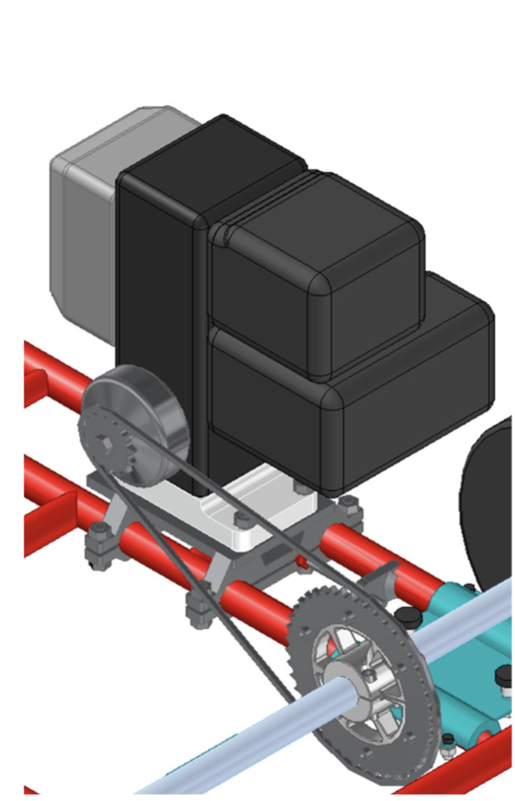
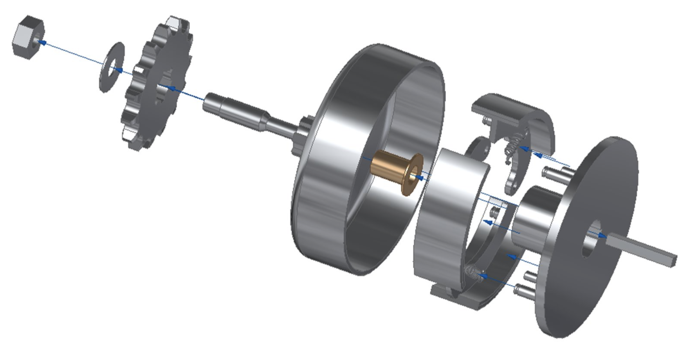
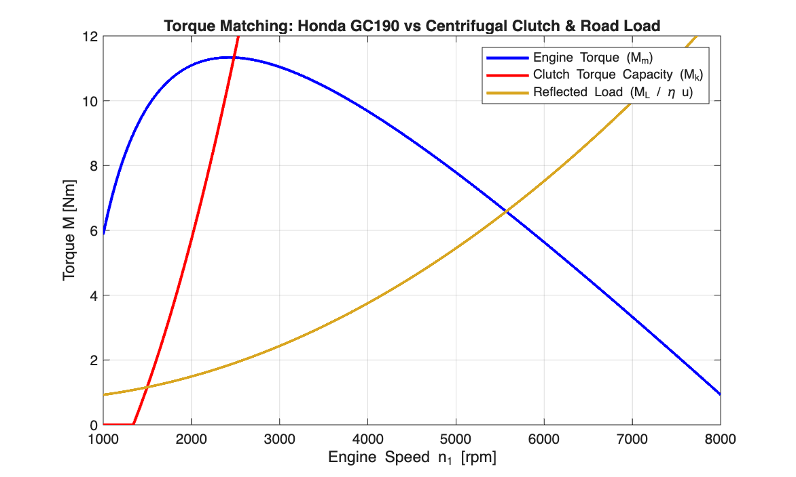
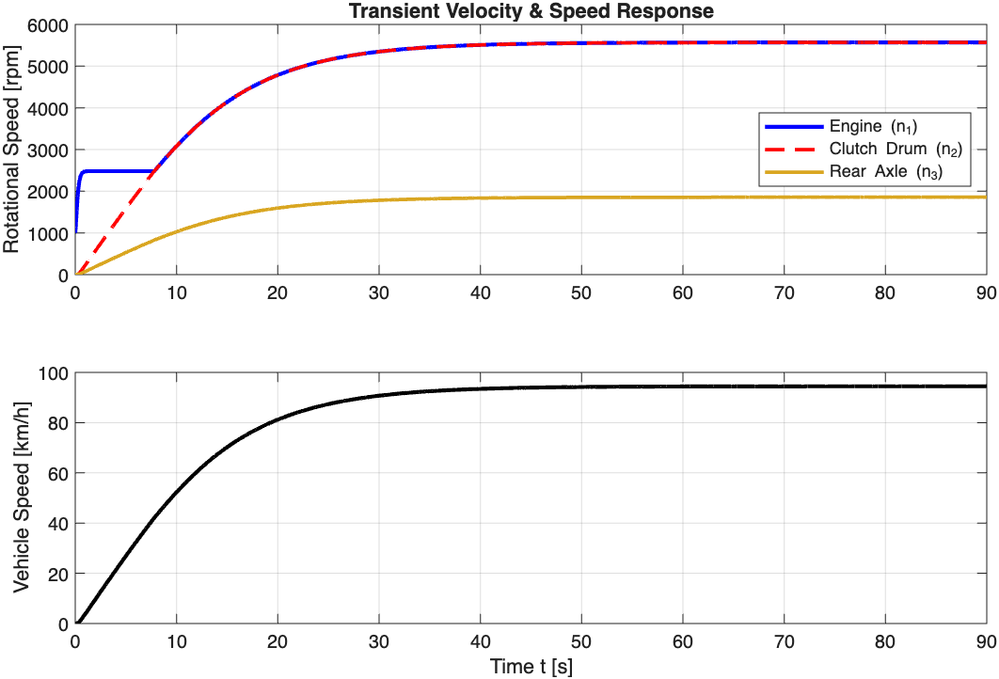

# Gokart Drivetrain Mechanics & Dynamic Powertrain Simulation

A comprehensive mechanical design, standard-compliant machine element sizing, and dynamic simulation of a go-kart drivetrain powered by a 3.9 kW Honda GC190 internal combustion engine. 

The powertrain integrates a custom-designed centrifugal shoe clutch, a high-ratio 08B-1 roller chain transmission, a structural dual-clamp engine mount, and an integrated positive chain tensioner.

> **Documentation Note:** The complete technical design report detailing all analytical derivations and manufacturing limits is available in Swedish under [`docs/Drivlina_Design_Och_Simulering_Rapport.pdf`](docs/Drivlina_Design_Och_Simulering_Rapport.pdf).

---

## 1. System Architecture & Powertrain Assembly

The powertrain delivers continuous torque to a solid 30 mm rear axle while accommodating stationary engine idling through automatic centrifugal clutching.



*Figure 1:* Detailed CAD assembly of the complete powertrain subsystem integrated onto the tubular chassis frame.

### Subsystem Highlights
* **Engine Mount:** Two-piece clamping brackets fastened to the tubular chassis with M10 grade 8.8 bolts, allowing precise longitudinal alignment.
* **Chain Tensioner:** Frame-welded bracket featuring an M8 fine-adjustment jack screw with locknut to counteract chain slack under load.
* **Centrifugal Clutch:** Custom 3-shoe expanding drum clutch with sintered bronze flanged bushing for idle freewheeling.
* **Final Drive:** 08B-1 roller chain ($u = 3.0$) driving a 45-tooth rear sprocket secured to the axle via a split-hub friction clamp and SMS 2306 feather key.

### Key Technical Specifications
* **Engine:** Honda GC190 (Single-cylinder 4-stroke, $187\ \mathrm{cm^3}$, horizontal S-type shaft)
* **Max Net Power / Torque:** $3.9\ \mathrm{kW}$ @ $3600\ \mathrm{rpm}$ / $11.2\ \mathrm{Nm}$ @ $2500\ \mathrm{rpm}$
* **Clutch Engagement / Lockup:** $n_A = 1400\ \mathrm{rpm}$ / $n_B = 2482\ \mathrm{rpm}$
* **Drive Ratio:** $u = 3.0$ ($z_1 = 15$ drive, $z_2 = 45$ driven sprocket)
* **Total System Mass:** $135\ \mathrm{kg}$ (Go-kart chassis + $65\ \mathrm{kg}$ driver)

---

## 2. Mechanical Design & Centrifugal Clutch Equilibrium



*Figure 2:* Exploded CAD assembly of the 3-shoe centrifugal clutch, showing the extension shaft, sintered bronze flanged bushing, shoes, and return springs.

### Analytical Normal Force Derivation
The total torque transmitted by the clutch across its $z = 3$ friction shoes is governed by:

$$M_k = z \cdot \mu \cdot N \cdot \frac{D_i}{2}$$

where $D_i = 104\ \mathrm{mm}$ is the internal drum diameter and $\mu = 0.30$ is the friction coefficient. Taking moment equilibrium around the shoe pivot point $A$:

$$\sum M_A = (m_b r_{tp} \omega^2 L_c) + (\mu N L_\mu) - (F_{fj} L_{fj}) - (N L_N) = 0$$

Solving explicitly for the shoe contact normal force $N$:

$$N = \frac{m_b r_{tp} \omega^2 L_c - F_{fj} L_{fj}}{L_N - \mu L_\mu}$$

### Parameter Optimization (MATLAB)
Solving the two-point boundary system ($N=0$ at $n_A = 1400\ \mathrm{rpm}$, full torque capacity at $n_B = 2482\ \mathrm{rpm}$) yielded:
* **Optimal Shoe Mass:** $m_b = 0.079\ \mathrm{kg}$ (CAD model verified at $0.079\ \mathrm{kg}$)
* **Return Springs (Lesjöfors #9492):** $R = 6.964\ \mathrm{N/mm}$, mounted pre-tension force $F_0 = 4.5\ \mathrm{N}$, operational extension force $F_{fj} = 36.56\ \mathrm{N}$.

---

## 3. Machine Element Verification (Standards Compliance)

All critical joints and bearing surfaces were sized against industrial machine element standards:

| Component / Subsystem | Design Standard / Method | Calculated Stress / Load | Allowable Limit | Safety Factor / Status |
| :--- | :--- | :--- | :--- | :--- |
| **Clutch Bushing (Sintered Bronze)** | Hydrodynamic / Boundary PV | $p = 0.92\ \mathrm{MPa}$, $v = 2.6\ \mathrm{m/s}$ | $p_{\max} = 10\ \mathrm{MPa}$, $v_{\max} = 5.0\ \mathrm{m/s}$ | **Verified** ($p \ll p_{\max}$) |
| **Engine Shaft Keyway** | SMS 2305 (Flat Key) | Min length $L_{ks,\min} = 9.0\ \mathrm{mm}$ | Actual $L = 35.0\ \mathrm{mm}$ ($p_{\max} = 200\ \mathrm{MPa}$) | **$3.88\times$ Overdesigned** |
| **Clutch-to-Sprocket Spline** | Straight-sided Spline ($z_b=6$) | Surface pressure $p_b = 22.2\ \mathrm{MPa}$ | $p_{b,\max} = 30.0\ \mathrm{MPa}$ | **Passed** ($S_F = 1.35$) |
| **Roller Chain Drive** | DIN 8187 ($08\mathrm{B}\text{-}1$, $P=12.7\ \mathrm{mm}$) | Bearing pressure $P_L = 734\ \mathrm{N/cm^2}$ | $P_{L,\max} = 1000\ \mathrm{N/cm^2}$ | **Passed** ($S_F = 1.36$) |
| **Rear Axle Keyway** | SMS 2306 (Round-ended Key) | Min length $l_{kd,\mathrm{tot}} = 11.1\ \mathrm{mm}$ | Actual $L = 45.0\ \mathrm{mm}$ ($p_{\max} = 200\ \mathrm{MPa}$) | **$4.05\times$ Overdesigned** |
| **Rear Axle Split Hub Clamp** | M8 Clamping Preload ($2\times$ Grade 8.8) | Normal clamping force $> 30\ \mathrm{kN}$ | Friction hold prevents axial slip |  |

---

## 4. Powertrain Simulation & Performance Verification

The system was simulated in MATLAB using `ode45` with variable inertia coupling across slipping and locked clutch states.



*Figure 3:* Steady-state engine torque matching against centrifugal clutch capacity and reflected aerodynamic/rolling road resistance.



*Figure 4:* Dynamic engine ($n_1$), clutch ($n_2$), and rear axle ($n_3$) rotational speeds during a full-throttle 0–90 second acceleration profile.

### Verification Against Project Requirements
* **Acceleration ($0 \rightarrow 50\ \mathrm{km/h}$):** Simulated at **$9.5\ \mathrm{s}$** (Requirement: $\le 10.0\ \mathrm{s}$)
* **Top Speed:** Theoretical maximum **$70.4\ \mathrm{km/h}$** at redline ($4000\ \mathrm{rpm}$) (Requirement: $\ge 65.0\ \mathrm{km/h}$) 
* **Clutch Slip Duration:** $7.7\ \mathrm{s}$ before full lockup at $2482\ \mathrm{rpm}$.

---

## 5. Running the Simulation

Open MATLAB, navigate to the `matlab/` directory, and run:

```matlab
run_simulation